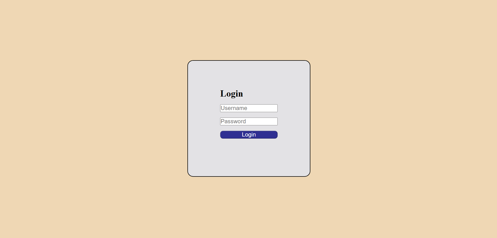

# Login Page Testing with Cypress

This project demonstrates UI testing of a basic login page using **Cypress**. It includes validations for login button states, valid/invalid login attempts, and behavior when fields are empty.

## 🧪 Technologies Used

- HTML, CSS, JavaScript (for the login page)
- [Cypress](https://www.cypress.io/) for end-to-end testing

## 📝 Features Covered

- Disabled login button on page load
- Button enabled only when both fields are filled
- Navigation on successful login
- Error message for invalid credentials
- Button remains disabled if fields are empty

### 📸 Sample Screenshot

Here is a screenshot of the Login Page:

### ✅ Valid Login Credentials

Use the following credentials to test successful login:

- **Username**: `corrUsername`  
- **Password**: `corrPassword`

> ℹ️ *Ensure your HTML paths and Cypress test setup are properly configured when testing locally.*

## 👨‍💻 Author

**Madhav Agrawal**  
📧 [agrawalmad00@gmail.com](mailto:agrawalmad00@gmail.com)  
📱 +91 7618830195
